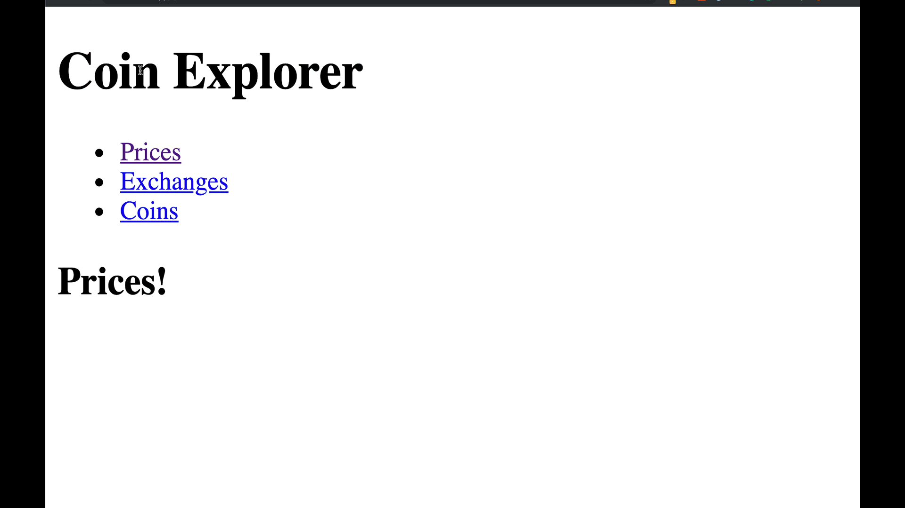

# Day3
> 오늘의 강의: #2.1 ~ #2.2   
> 오늘의 과제: 위의 강의들을 시청하신 후, 아래 코드 챌린지를 제출하면 됩니다.

<br/>

[[멤버십] 초보를 위한 React JS](https://academy.nomadcoders.co/courses/436641/lectures/8467057)
- 2.0 Setting Up the Project
- 2.1 React Router Part One
- 2.2 React Router Part Two

<br/>

---

<br/>

## Lecture Summery


<br/>

### 2.0 Setting Up the Project

<br/>

#### React
React는 사용자 인터페이스를 구축하기 위한 선언적이고 효율적이며 유연한 JavaScript 라이브러리다.  

<br/>

#### create-react-app
create-react-app은 페이스북에서 만든 react 웹 개발용 boilerplate이다.

- 설치 및 사용
```
$ npx create-react-app my-app
$ cd my-app
$ yarn start
```

> **주의**   
> 첫 번째 줄의 ‘npx’는 실수가 아니며 npm 5.2+ 버전의 패키지 실행 도구.
 
<br/>

- Output
```
my-app
├── README.md
├── node_modules
├── package.json
├── .gitignore
├── public
│   ├── favicon.ico
│   ├── index.html
│   └── manifest.json
└── src
    ├── App.css
    ├── App.js
    ├── App.test.js
    ├── index.css
    ├── index.js
    ├── logo.svg
    └── serviceWorker.js
```

> 사용하지 않는 파일 및 내용을 삭제하여 기본적인 설치를 완료합니다.

<br/>

### React Router
React는 페이지 이동을 하며 사이트를 보여주는 기존의 웹사이트와 달리 `SPA`다. 즉 페이지가 1개로 이루어져 있다. 
하지만 여러가지 정보를 보여주기 위해 주소에 따라 다양한 뷰를 보여줘야 하는데 이럴때 사용할 수 있는게 `React Router`이다.

- 라우팅 : 다른 주소에 따라 다른 뷰를 보여주는 것
- SPA : Single Page Application 말 그대로, 페이지가 1개인 어플리케이션

<br/>

#### 설치
[React Router](https://reacttraining.com/react-router)에 보면 Web, Native, Core에 대한 설치 및 사용방법이 자세히 나와 있다.  
그중 web에서 사용할 수 있는 `react-router-dom`에 대해 알아보자.

```
yarn add react-router-dom
```

<br/>

#### 사용
`App.js`
```jsx harmony
import React, { Component } from "react";
import Router from "Components/Router";
import Header from "Components/Header";

class App extends Component {
  render() {
    return (
      <>
        <Header />
        <Router />
      </>
    );
  }
}

export default App;
```

<br/>

`Router.js`
```jsx harmony
import React from "react";
import {
  BrowserRouter as Router,
  Route,
  Redirect,
  Switch
} from "react-router-dom";
import Home from "Routes/Home";
import TV from "Routes/TV";
import Search from "Routes/Search";

export default () => (
  <Router>
    <Switch>
      <Route path="/" exact component={Home} />
      <Route path="/tv" component={TV} />
      <Route path="/search" component={Search} />
      <Redirect from="*" to="/" />
    </Switch>
  </Router>
);
```

- `React Router`을 사용하기 위해 다음과 같이 import 해준다. as 를 이용하여 Router 라는 이름으로 쓸것이다.
- 각각 url로 들어 갔을 때 보여줄 컴포넌트들을 import 해준다.
- <Route>를 <Router>로 감싸준다. Switch를 사용하면 해당하는 url을 찾아 그 컴포넌트를 그려주고 빠져나온다.
- exact 또는 exact={true} 는 / 가 포함된 url이 아니라 정확히/ 로 들어왔을 때만 해당 컴포넌트를 그려주게 해주는 것이다. 이것을 안해주면 /search /tv 등등 다른 url에서도 / 을 포함하고 있기 때문에 의도치 않게 함께 그려지는 것을 방지해야 한다.

<br/>

`Header.js`
```jsx harmony
import React from "react";

export default () => (
  <header>
    <ul>
      <li>
        <Link to="/">Movies</Link>
      </li>
      <li>
        <Link to="/tv">TV</Link>
      </li>
      <li>
        <Link to="/search">Search</Link>
      </li>
    </ul>
  </header>
);
```

URL 이동시키기
- Link : a 태그와 같다. 하지만 SPA 특성상 a태그 처럼 새로고침이 발생하면 안되기에, a 태그를 기반으로 기능상의 개선을 통해 새로고침없이 다른 뷰를 렌더 하기위해 사용하는 것이다.
- history.push : Route는 컴포넌트에 기본적으로 match, history, location 이라는 것을 넘겨준다. 이때 histroy.push(‘/인자’) 함수에 인자를 넣어주면 해당 인자로 url을 새로고침 없이 이동시켜준다.

<br/>

#### match, history, location
Component에 별도로 설정을 안해주었음에 불구하고, Route의 컴포넌트에 기본적으로 props로 match, history, location을 넘겨준다.

- `history`
    - 브라우저의 window.history 와 유사
    - 주소를 임의로 변경하거나 되돌아 갈 수 있도록 한다.
    - 주소 변경시, SPA 특성을 지키기 위해 페이지 전체를 리로드 하지 않는다.
    - location 이 포함되어 있다.

<br/>

- `location`
    - 브라우저의 window.location 와 유사
    - 현재 페이지 정보를 지니고 있다.
    - url의 query 정보를 search라는 프로퍼티에 가지고 있다.
 
 <br/>
    
- `match`
  - Route의 path에 정의한 것과 매칭된 정보를 가지고 있다.
  - params 에 설정한 파라미터를 담고 있다.
  
<br/>    

<br/>

### Reference
- [새로운 React 앱 만들기](https://ko.reactjs.org/docs/create-a-new-react-app.html)
- [간단 리엑트 소개와 앱 실행하기](https://kingname.tistory.com/105)
- [facebook/create-react-app](https://github.com/facebook/create-react-app/releases/tag/v3.0.0)
- [React Router](https://reacttraining.com/react-router/)
- [React Router V4 정리](https://medium.com/@han7096/react-router-v4-정리-e9931b63dcae)

---

<br/>

## Homework 
[Day3 템플릿](https://codesandbox.io/s/day-three-blueprint-hdx6m)



<br/>

### Constraints
- DO NOT create or delete ANY file.
- DO NOT use <a></a>

<br/>

### Submit

`My Answer`
[Day3 CodeSandbox](https://codesandbox.io/s/day-three-blueprint-nplo3)

`Components/Header.js`
```jsx harmony
import React from "react";
import { Link } from "react-router-dom";

export default () => (
  <header>
    <ul>
      <li>
        <Link to="/prices">Prices</Link>
      </li>
      <li>
        <Link to="/exchanges">Exchanges</Link>
      </li>
      <li>
        <Link to="/coins">Coins</Link>
      </li>
    </ul>
  </header>
);
```

<br/>

`Components/Router.js`
```jsx harmony
import React from "react";
import { HashRouter as Router, Route } from "react-router-dom";
import Header from "./Header";
import Coins from "../Screens/Coins";
import Exchanges from "../Screens/Exchanges";
import Prices from "../Screens/Prices";

export default () => {
  return (
    <Router>
      <Header />
      <Route path="/coins" component={Coins} />
      <Route path="/exchanges" component={Exchanges} />
      <Route path="/prices" component={Prices} />
    </Router>
  );
};
```

<br/>

`Correct`
[]()
```javascript

```
