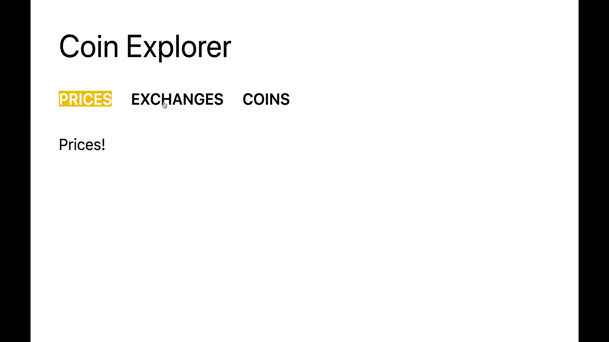

# Day4
> 오늘의 강의: #3.0 ~ #3.4
> 오늘의 과제: 위의 강의들을 시청하신 후, 아래 코드 챌린지를 제출하면 됩니다.

<br/>

[[멤버십] 초보를 위한 React JS](https://academy.nomadcoders.co/courses/436641/lectures/8467057)
- 3.0 CSS in React part One
- 3.1 CSS in React part Two
- 3.2 CSS in React part Three
- 3.3 GlobalStyles and Header
- 3.4 Location Aware Header

<br/>

---

<br/>

## Lecture Summery


<br/>

### CSS in React

#### styles.css
- styles.css 생성 후 index.js에서 import
- 장점 : 사용방법이 쉬움
- 단점 : 컴포넌트와 css 파일이 분리되어 있음

```
my-app
└── src
    ├── index.js    // import "styles.css";
    ├── styles.css
    ├── Router
    └── Components
```

<br/>

#### 폴더에 정리
- components폴더 안에 js 파일과 css 파일을 함께 생성하여 js 파일에서 import
- 장점 : 파일이 한 폴더에 모여있어 찾기 쉬움.
- 단점 : 사용할때마다 import 해줘야 함. className을 기억해서 반복되지 않도록 해야함.
- 사용 : `<header className="nav">`

```
my-app
└── src
    ├── App.js
    ├── Router.js
    └── Components
        └── Header
            ├── Header.css   // className을 사
            ├── Header.js    // import "./Header.css";
            └── index.js
```

<br/> 

#### css모듈 사용
- css가 global이 아닌 local이 되게 함.
- 사용 : `<ul className={styles.navList}>`
- 렌더시 랜덤한 className이 생성.
- sass 사용시 node-sass 설
- 단점 : 여전히 css모듈에서 사용된 className을 기억해야함.
```
my-app
└── src
    ├── App.js
    ├── Router.js
    └── Components
        └── Header
            ├── Header.module.css 또는 Header.module.sass  
            ├── Header.js    // import styles from "./Header.module.css";
            └── index.js
```

<br/>  

#### styled-components 사용
- 설치
```
yarn add styled-components
```

<br/>

- 사용
```jsx harmony
import React from "react";
import { Link } from "react-router-dom";
import styled from "styled-components";

const Header = styled.header``;

const List = styled.ul`
  display: flex;
  &:hover {
    background-color: blue;
  }
`;

const Item = styled.li``;

const SLink = styled(Link)``;

export default () => (
  <Header>
    <List>
      <Item>
        <SLink to="/">Movies</SLink>
      </Item>
      <Item>
        <SLink to="/tv">TV</SLink>
      </Item>
      <Item>
        <SLink to="/search">Search</SLink>
      </Item>
    </List>
  </Header>
);
```
<br/>

- `styled-components` 을 사용해서 스타일링 할 수 있다.
- `this -> &` 로 내부에서 사용가능
- `props` 도 사용 가능하다.
- `GlobalStyle` 적용시 전체 스타일을 설정할 수 있다. `reset` 사용

<br/>

<br/>

### GlobalStyles and Header

#### global 설정
- 설치
```
yarn add styled-reset
```

<br/>

- 사용
```
my-app
└── src
    ├── Routes
    └── Components
        ├── GlobalStyles.js
        ├── App.js
        ├── Header.js
        └── Router.js
```   

`GlobalStyles.js`
```jsx harmony
import { createGlobalStyle } from "styled-components";
import reset from "styled-reset";

const globalStyles = createGlobalStyle`
    ${reset};
    a{
        text-decoration:none;
        color:inherit;
    }
    *{
        box-sizing:border-box;
    }
    body{
        font-family:-apple-system, BlinkMacSystemFont, 'Segoe UI', Roboto, Oxygen, Ubuntu, Cantarell, 'Open Sans', 'Helvetica Neue', sans-serif;
        font-size:12px;
        background-color:rgba(20, 20, 20, 1);
        color:white;
        padding-top:50px;
    }
`;

export default globalStyles;
```
<br/>

### Location Aware Header
- withRouter를 이용하여 현재의 location정보를 이용   

`Header.js`
```jsx harmony
import React from "react";
import { Link, withRouter } from "react-router-dom";
import styled from "styled-components";

const Header = styled.header`
  color: white;
  position: fixed;
  top: 0;
  left: 0;
  width: 100%;
  height: 50px;
  display: flex;
  align-items: center;
  background-color: rgba(20, 20, 20, 0.8);
  z-index: 10;
  box-shadow: 0px 1px 5px 2px rgba(0, 0, 0, 0.8);
`;

const List = styled.ul`
  display: flex;
`;

const Item = styled.li`
  width: 80px;
  height: 50px;
  text-align: center;
  border-bottom: 3px solid
    ${props => (props.current ? "#3498db" : "transparent")};
  transition: border-bottom 0.5s ease-in-out;
`;

const SLink = styled(Link)`
  height: 50px;
  display: flex;
  align-items: center;
  justify-content: center;
`;

export default withRouter(({ location: { pathname } }) => (
  <Header>
    <List>
      <Item current={pathname === "/"}>
        <SLink to="/">Movies</SLink>
      </Item>
      <Item current={pathname === "/tv"}>
        <SLink to="/tv">TV</SLink>
      </Item>
      <Item current={pathname === "/search"}>
        <SLink to="/search">Search</SLink>
      </Item>
    </List>
  </Header>
));

```
<br/>

<br/>

### Reference
- [다양한 방식의 리액트 컴포넌트 스타일링 방식](https://velog.io/@velopert/react-component-styling)
- [Sass 강좌 – 한 눈에 보기](https://velopert.com/1712)
- [Sass 작성을 위한 주관적인 스타일가이드.](https://sass-guidelin.es/ko/)
- [리액트 Styled Components - 1편](https://velog.io/@taewo/%EB%A6%AC%EC%95%A1%ED%8A%B8-Styled-Components-76jsolbaf8)
- [리액트 Styled Components - 2편](https://velog.io/@taewo/%EB%A6%AC%EC%95%A1%ED%8A%B8-Styled-Componets-2%ED%8E%B8)
- [React Styled-Component 공부](https://javaexpert.tistory.com/1020)

---

<br/>

## Homework 
[Day4 템플릿](https://codesandbox.io/s/day-four-boilerplate-jxch9)



<br/>

### Constraints
- Use **'styled-components'** , **'styled-reset'** and **'createGlobalStyle'**
- The header must be location aware and the links should reflect that.
- **DO NOT** use **ANY .css** file or **'className'** attribute.

<br/>

### Submit

`My Answer`
[Day4 Answer](https://codesandbox.io/s/day-four-boilerplate-tddjh)

`Header.js`
```jsx harmony
import React from "react";
import { Link, withRouter } from "react-router-dom";
import styled from "styled-components";

const Header = styled.header`
  padding: 30px 0;
`;

const List = styled.ul`
  display: flex;
`;

const Item = styled.li`
  font-size: 15px;
  font-weight: bold;
  margin: 0 20px 0 0;
  background: ${props => (props.current ? "#faa" : "#fff")};
  color: ${props => (props.current ? "#fff" : "#000")};
`;

export default withRouter(({ location: { pathname } }) => (
  <Header>
    <List>
      <Item current={pathname === "/"}>
        <Link to="/">PRICES</Link>
      </Item>
      <Item current={pathname === "/exchanges"}>
        <Link to="/exchanges">EXCHANGES</Link>
      </Item>
      <Item current={pathname === "/coins"}>
        <Link to="/coins">COINS</Link>
      </Item>
    </List>
  </Header>
));

```

<br/>

`correct`
[Day4 Currect](https://codesandbox.io/s/day-four-solution-3j7gi)
